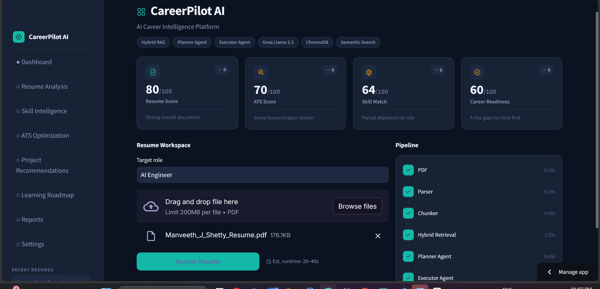
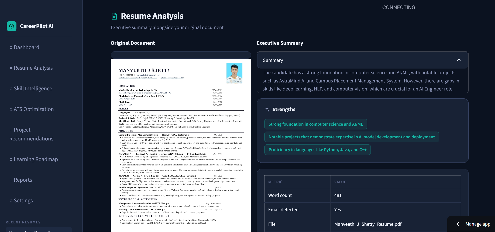
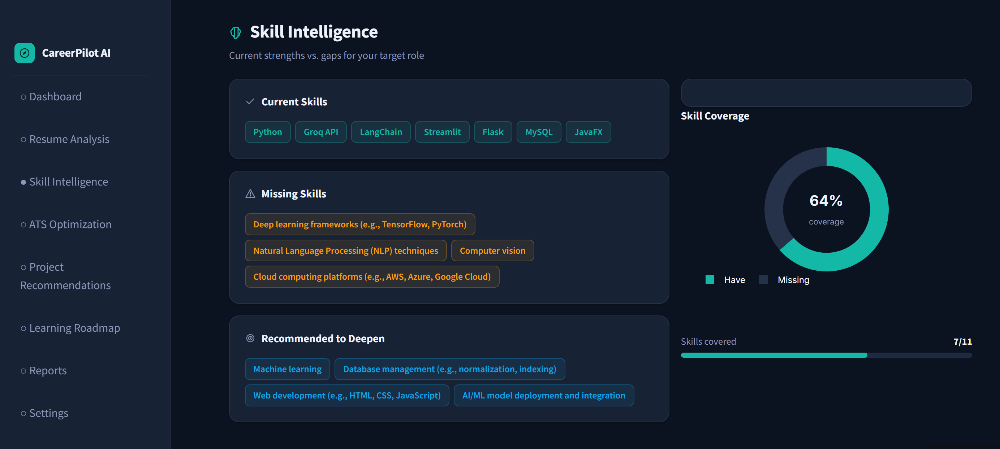
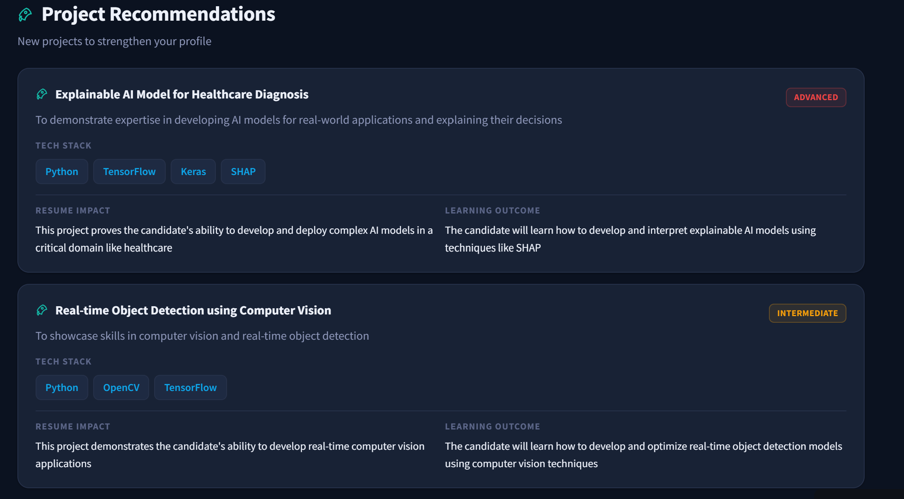

# CareerPilot AI

**An agentic, RAG-powered resume intelligence platform.** Upload a resume PDF, set a target role, and get a skill-gap analysis, project recommendations, an ATS compatibility check, and a prioritized action plan — each grounded in your actual resume content via hybrid retrieval, not a single generic prompt.

[](https://www.python.org/)
[](https://streamlit.io/)
[](https://groq.com/)
[](#architecture)
[](#architecture)
[](#license)

**Live demo:** https://careerpilot-ai-mj.streamlit.app/
**Repo:** [github.com/manveethshetty/CareerPilot-AI-Capstone](https://github.com/manveethshetty/CareerPilot-AI-Capstone)



---

## Project Motivation

Most "AI resume analyzer" projects — including the majority of bootcamp capstones on this exact theme — are a single LLM call: paste the resume text into a prompt, get feedback back. That's fast to build, but it has two real problems. First, stuffing an entire resume into one prompt gives the model no way to focus, so feedback tends toward generic advice that could apply to almost anyone. Second, there's no actual *system* to reason about — it's a chatbot wearing a resume-shaped hat.

CareerPilot AI was built to be a genuine small agentic system instead: a **Planner** that decides what analysis needs to happen, an **Executor** that runs a set of independent tools to do it, and a **hybrid retriever** that grounds each tool in only the resume sections relevant to its specific question — not the whole document every time. The goal wasn't to make the UI look impressive (though it does); it was to make the underlying pipeline something that could actually be defended, tool by tool, in a technical interview.

## Architecture

```
                    ┌──────────────┐
   Resume PDF  ───▶ │  PDF Parser  │  pdfplumber
                    └──────┬───────┘
                           ▼
                    ┌──────────────┐
                    │   Chunker    │  section-aware (Skills, Projects, Experience...)
                    └──────┬───────┘
                           ▼
              ┌─────────────────────────┐
              │   Hybrid Retriever       │
              │   BM25 (lexical)          │
              │   + bge-small embeddings │
              │   → ChromaDB              │
              └──────────┬────────────────┘
                          ▼
              ┌────────────────────┐   decides which tools run,
              │   Planner (LLM)     │───────────────┐   and in what order
              └──────────┬──────────┘                │
                         ▼                            ▼
              ┌─────────────────────────────────────────────────┐
              │                   Executor                        │
              │  ┌───────────┐ ┌────────────┐ ┌────────────────┐│
              │  │ Skill Gap │ │  Project    │ │  ATS Keyword    ││
              │  │ Analysis  │ │ Suggestions │ │  Check          ││
              │  └───────────┘ └────────────┘ └────────────────┘│
              │                 ▼ (all feed into)                 │
              │        Overall Recommendations (synthesizer)      │
              └──────────────────────┬──────────────────────────┬─┘
                                      ▼                          ▼
                             Streamlit Dashboard            JSON History
                                                            (session memory)
```

**Planner → Executor.** The Planner is a dedicated LLM call that looks at a resume summary and target role and *decides* which analysis tools are relevant and in what order — the control flow is a model decision, not a hardcoded sequence. The Executor then runs that plan, passing results forward so the final synthesis step has context from everything that ran before it.

**Hybrid RAG, not naive chunking.** Resumes are short, so instead of fixed-size windows, the chunker splits on detected section headings (Skills, Projects, Experience, Education) and only falls back to a sliding window for oversized sections — keeping each chunk semantically coherent. Retrieval combines two signals: BM25 for exact keyword matches (tool names, certifications) and `BAAI/bge-small-en-v1.5` embeddings via ChromaDB for semantic matches (e.g. "built REST APIs" matching a query about backend experience). Scores are fused with a tunable weight rather than picking one method.

**Grounded, not fabricated, output.** Every tool issues its own targeted retrieval query and generates JSON-mode output from Groq (Llama 3.3 70B) with a manual fallback parser. Numeric scores (resume score, ATS score, career readiness, keyword coverage, etc.) are the LLM's judgment grounded in the actual analysis that ran — not decorative numbers invented in the UI layer.

## Screenshots

| Dashboard | Resume Analysis |
|---|---|
|  |  |
| Live KPI cards with real trend deltas, resume workspace, and a pipeline visualization with real measured per-stage timing | Split view — original PDF alongside an LLM-generated executive summary and strengths |

| Skill Intelligence | Project Recommendations |
|---|---|
|  |  |
| Current / missing / recommended skill chips with a real coverage donut computed from the actual gap | Premium project cards with difficulty, tech stack, resume impact, and learning outcome — all LLM-generated and grounded in retrieved resume context |

_ATS Optimization and Learning Roadmap pages exist and function identically to the above — screenshots to be added._

## Features

- **Skill Intelligence** — current skills, missing skills, and skills to deepen, with a real coverage percentage computed from the actual gap (not hardcoded)
- **ATS Optimization** — missing keywords, formatting risk flags, and five sub-scores (overall, keyword coverage, formatting, readability, section health)
- **Project Recommendations** — new projects to build, each with difficulty, tech stack, resume impact, and learning outcome
- **Learning Roadmap** — prioritized next steps, sequenced across a 90-day window
- **Trend tracking** — KPI cards show a real delta against your previous analysis (stored in a lightweight JSON history), not a fake up/down arrow
- **Real pipeline timing** — the live pipeline visualization on the dashboard shows actual measured wall-clock time per stage (`time.perf_counter()`), not simulated pacing
- **Split PDF preview** — view your original resume alongside the analysis, rendered as images (no browser plugin dependency)

## Tech stack

| Layer | Choice | Why |
|---|---|---|
| UI | Streamlit | Fast to ship a data-app UI; custom CSS layer removes the default Streamlit look |
| LLM | Groq — Llama 3.3 70B | Free tier, fast inference, JSON mode |
| Embeddings | `sentence-transformers` (`BAAI/bge-small-en-v1.5`) | Small, fast, strong retrieval quality for short documents |
| Vector store | ChromaDB (in-memory, per session) | Zero-config semantic search |
| Lexical search | `rank-bm25` | Catches exact keyword/tool-name matches embeddings can dilute |
| PDF parsing | `pdfplumber` + `pypdfium2` | Reliable text extraction and page rendering, pure-Python |
| Charts | Plotly | Donut/bar charts grounded in real tool-output counts |
| Memory | Local JSON | Lightweight session history for trend deltas |

## Project structure

```
CareerPilot-AI-Capstone/
├── app.py                    # Streamlit entrypoint — 8-page dashboard
├── agent/
│   ├── planner.py             # decides which tools to run, and in what order
│   ├── executor.py            # runs the plan, passes results forward
│   ├── tools.py                 # skill gap / projects / ATS / synthesis tools
│   └── llm_client.py             # Groq wrapper, JSON-mode with fallback parsing
├── rag/
│   ├── chunker.py             # section-aware resume chunking
│   └── retriever.py           # hybrid BM25 + semantic retrieval (ChromaDB)
├── utils/
│   ├── pdf_parser.py          # PDF text extraction
│   ├── memory.py                # JSON history + score trend tracking
│   ├── ui.py                     # design system: cards, KPIs, chips, pipeline viz
│   ├── charts.py                # Plotly charts (skill coverage, ATS breakdown)
│   └── icons.py                  # line-icon set
├── screenshots/               # README images
├── data/                      # history.json (gitignored)
├── requirements.txt
├── .env.example
└── README.md
```

## Setup

```bash
git clone https://github.com/manveethshetty/CareerPilot-AI-Capstone.git
cd CareerPilot-AI-Capstone
python -m venv .venv
.venv\Scripts\activate          # macOS/Linux: source .venv/bin/activate
pip install -r requirements.txt
cp .env.example .env            # then add your GROQ_API_KEY
streamlit run app.py
```

## Design decisions worth knowing

A few honest calls made along the way, in case they come up in review:

- **Numeric scores are additive LLM output, not UI decoration.** The Planner/Executor pipeline originally only returned lists (skills, projects, flags). The dashboard needed real numbers, so `tool_overall_recommendations` and `tool_ats_keyword_check` were extended to also return grounded 0–100 scores — same retrieval-grounded pattern as everything else, not fabricated in the presentation layer.
- **The 90-day roadmap is a pacing suggestion, not a scheduled plan.** The backend produces 3 prioritized action items; the UI maps them to Day 1–30/31–60/61–90 windows for readability. It's a display choice on real content, not synthetic data.
- **Pipeline stage timings are real measurements**, taken with `time.perf_counter()` around each actual step — except the Executor Agent and LLM stages, which show the same number, because they're genuinely the same code path (the Executor's loop *is* the code that calls the LLM) rather than two independently-timed stages.
- **Chart types were limited to what the data actually supports.** No radar chart or heatmap — those would need invented categories the tools don't produce. Only charts backed by real counts (skill coverage, ATS issue breakdown) made the cut.
- **PDF preview renders pages as images, not an embedded viewer.** An earlier version embedded the PDF via a base64 data-URI iframe, which several browsers (including Edge) block by default as a security measure. Rendering each page to an image with `pypdfium2` sidesteps that entirely and works identically across browsers and deployment environments.

## Known limitations

- ChromaDB runs in-memory per session; the vector index resets on app restart (analysis history persists separately via JSON).
- Scanned/image-only PDFs won't extract text — no OCR step. Works best with text-based PDF exports (the vast majority from Word/LaTeX/Canva).
- Free-tier Groq rate limits apply; very rapid repeated analyses may hit them.

